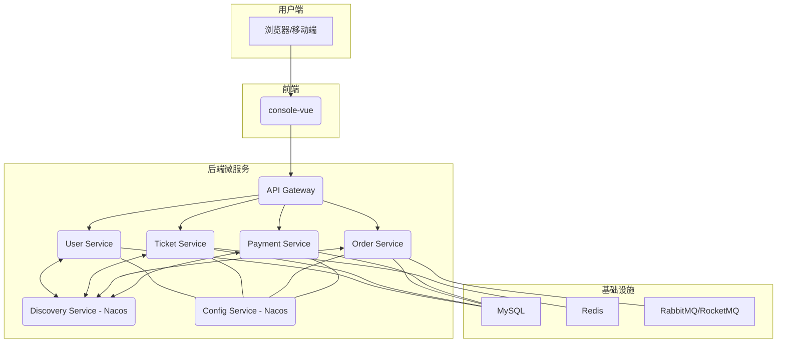

# 12306 铁路购票平台

## 1. 项目简介

本项目是一个基于微服务架构的现代化铁路购票平台，旨在模拟并优化 12306 的核心业务流程。平台采用前后端分离的设计思想，后端基于 Spring Cloud Alibaba 构建高可用、可扩展的微服务集群，前端则采用 Vue.js 框架打造用户友好的交互界面。

## 2. 项目架构

项目采用 Monorepo（单体代码库）模式进行管理，以确保代码的一致性和易于维护。

### 2.1 架构图



### 2.2 目录结构

```
/12306
├── console-vue/     # 前端工程 (Vue.js)
├── dependencies/    # 统一依赖管理 (Maven BOM)
├── frameworks/      # 公共框架/组件 (自定义 Starter, 工具类)
├── resources/       # 数据库资源 (SQL 脚本)
├── services/        # 后端微服务
│   ├── user-service/
│   ├── ticket-service/
│   ├── order-service/
│   └── payment-service/
├── tests/           # 测试工程 (集成测试, 端到端测试)
└── readme.md        # 项目总说明
```

## 3. 技术栈

| 分类     | 技术                               | 说明                                     |
| :------- | :--------------------------------- | :--------------------------------------- |
| **前端** | Vue.js, Element-Plus, Axios, Vite  | 响应式 Web 界面                          |
| **后端** | Spring Boot, Spring Cloud Alibaba  | 微服务核心框架                           |
| **网关** | Spring Cloud Gateway               | API 路由、过滤、限流                     |
| **注册/配置** | Nacos                            | 服务发现与配置中心                       |
| **数据库** | MySQL 8.0+                         | 关系型数据存储                           |
| **缓存** | Redis                              | 热点数据缓存（如：余票、用户信息）       |
| **消息队列** | RabbitMQ / RocketMQ                | 异步任务、削峰填谷（如：下单、支付通知） |
| **依赖管理** | Maven                              | 项目构建与依赖管理                       |
| **测试** | JUnit 5, Mockito                   | 单元测试与集成测试                       |

## 4. 模块介绍

*   **`console-vue`**: 前端用户界面，提供车票查询、下单、支付等功能。
*   **`dependencies`**: 定义所有后端模块的依赖版本，确保版本统一。
*   **`frameworks`**: 包含项目通用的核心依赖、工具类、配置等。
*   **`resources`**: 存放数据库初始化脚本和升级脚本。
*   **`services`**:
    *   `user-service`: 处理用户注册、登录、认证、信息管理等。
    *   `ticket-service`: 核心票务服务，负责车次查询、余票计算、座位锁定等。
    *   `order-service`: 负责订单的创建、状态流转、查询等。
    *   `payment-service`: 对接第三方支付平台，处理支付逻辑。
*   **`tests`**: 存放各类测试用例，保障项目质量。

## 5. 快速启动

*(待补充详细启动步骤)*

1.  **环境准备**:
    *   JDK 17+
    *   Maven 3.8+
    *   Node.js 18+
    *   MySQL 8.0
    *   Nacos 2.x
    *   Redis 7.x
2.  **后端启动**:
    *   配置 Nacos。
    *   依次启动 `user-service`, `ticket-service`, `order-service`, `payment-service`。
3.  **前端启动**:
    *   进入 `console-vue` 目录。
    *   执行 `npm install`。
    *   执行 `npm run dev`。
